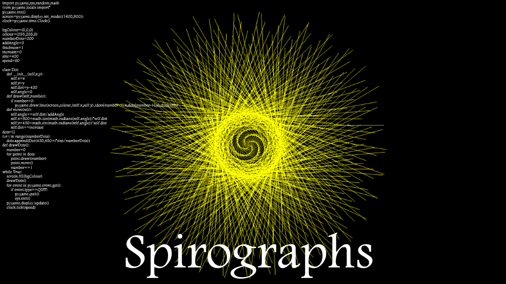
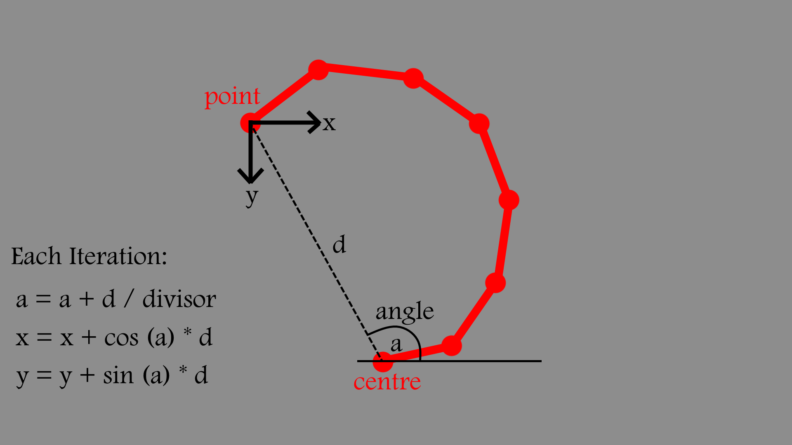

# Spirograph Generator 
## Developed for a YouTube educational video on programming (2019)

YouTube: https://www.youtube.com/watch?v=g4z_WIGb1a0

Created in PyGame, tweak the parameters to get different colours, shapes, sizes and speeds.

# Gallery

